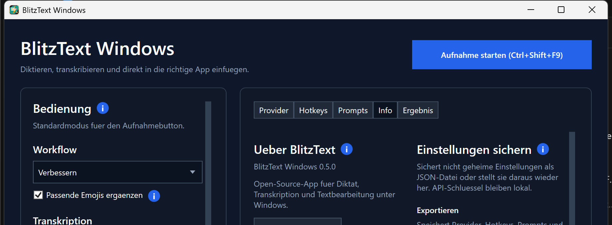

# BlitzText Windows

**Press a hotkey, speak, and get polished text directly in the app you are using.**

BlitzText is an open-source Windows dictation app. It records your voice, transcribes it, optionally improves or calms down the wording, and copies or pastes the result into your active window.



> A short real-workflow demo is planned to show hotkey → speech → transcription → polished text.

## Install BlitzText 0.5.0

### Recommended: latest GitHub release

Download and run the current per-user MSI:

[**Download BlitzText Windows 0.5.0**](https://github.com/EinsVier/blitztext-windows/releases/download/v0.5.0/BlitzText-Windows-0.5.0-win-x64.msi)

The MSI installs BlitzText for the current Windows user and requires the [.NET 8 Desktop Runtime](https://dotnet.microsoft.com/en-us/download/dotnet/8.0).

### Stable winget package

winget currently provides the earlier stable version 0.4.1:

```powershell
winget install --id EinsVier.BlitzText --exact
```

## Choose online, local, or both

| Setup | Transcription | Rewriting | What you need |
| --- | --- | --- | --- |
| Easiest online setup | OpenAI | OpenAI | Your own OpenAI API key; usage-based API charges may apply |
| Mostly local | Local `whisper.cpp` | Ollama | Local Whisper executable/model and a local or network Ollama server |
| Mixed | OpenAI or Local Whisper | OpenAI, OpenRouter, Anthropic, or Ollama | Configure only the providers you want |

- API keys are stored in Windows Credential Manager and are never included in settings exports.
- Online providers receive the audio or text required for the selected operation.
- Local Whisper and Ollama can keep transcription and rewriting on hardware you control.

## Why BlitzText

- **Works where you already type:** use a global hotkey and paste the result into the active Windows app.
- **More than transcription:** improve wording, calm down a message, apply one of 14 prompt presets, or add fitting emojis.
- **Your choice of providers:** combine online APIs with local Whisper and Ollama instead of being locked into one service.

## How it works

1. Press the configured workflow hotkey.
2. Speak your text.
3. Press the hotkey again.
4. BlitzText transcribes and optionally rewrites the recording.
5. The result is copied or pasted into the window you were using.

## Status and privacy

BlitzText Windows is an open-source preview for Windows 10 and 11. It is useful for daily testing, but it is not a polished commercial product. Review your provider configuration before using it with confidential material.

Provider behavior depends on your configuration:

- OpenAI transcription and rewrite requests send audio or text to the OpenAI API using your own API key.
- OpenRouter and Anthropic receive text only when selected for rewriting.
- Ollama rewrite requests go to the configured local or network Ollama server.
- Local Whisper transcription runs through your configured `whisper.cpp` executable and model file.

## Feature details

- WPF desktop app with tray controls, global workflow hotkeys, and an optional middle-mouse trigger.
- German and English UI, automatic/German/English dictation languages, and light/dark/system themes.
- OpenAI and local `whisper.cpp` transcription.
- OpenAI, OpenRouter, Anthropic, and Ollama rewriting.
- Improve and Calm workflows with an optional reusable emoji instruction.
- Fourteen editable prompt presets for messages, tasks, meetings, technical text, and AI prompts.
- Editable spoken and final text, local history, workflow reprocessing, and prompt inspection.
- Target-aware AutoPaste that restores the previous clipboard and supports editors such as Notepad++.
- Provider tests, setup checks, clearer errors, settings backup, update checks, and GitHub issue links.

## Requirements

- Windows 10/11.
- .NET 8 Desktop Runtime for running.
- OpenAI API key only when using OpenAI transcription or rewriting.
- Optional: OpenRouter API key for OpenRouter rewrite workflows.
- Optional: Anthropic API key for Claude rewrite workflows.
- Optional: Ollama installed and running for local rewrite workflows.
- Optional: `whisper.cpp` executable and a Whisper model file for local transcription.

## Inspiration

The original Blitztext idea comes from Christoph Magnussen. His macOS-focused open-source experiment is documented at:

- [blitztext.de](https://blitztext.de/)
- [Speech-to-Text auf Knopfdruck: Meine Blitztext App!](https://youtu.be/ygfqOmDWj94)

This Windows app is an independent Windows-first implementation, not a Swift/macOS code port or an official Christoph Magnussen or BLACKBOAT release. No macOS source files or brand assets are copied into this repository.

## Development

The .NET SDK is required for development.

## Build

```powershell
dotnet build
```

## Run

```powershell
dotnet run --project src\BlitzText.Windows
```

## Publish

Create a local runnable build:

```powershell
.\scripts\publish.ps1
```

The app will be written to:

```text
publish\BlitzText.Windows\BlitzText.Windows.exe
```

For a build that does not require a separately installed .NET Desktop Runtime:

```powershell
.\scripts\publish.ps1 -SelfContained
```

## Package

Create a ZIP package with app files, `install.ps1`, `uninstall.ps1`, and README:

```powershell
.\scripts\package.ps1
```

Create a ZIP package that does not require a separately installed .NET Desktop Runtime:

```powershell
.\scripts\package.ps1 -SelfContained
```

The ZIP is written to:

```text
publish\packages
```

The package script also refreshes:

```text
publish\packages\BlitzText-Windows-latest.zip
```

## Update Check

BlitzText does not silently replace itself in the background. The Info tab can check a small update manifest and open the configured download page when a newer version is available.

The default manifest URL is:

```text
https://raw.githubusercontent.com/EinsVier/blitztext-windows/master/update/latest.json
```

Manifest format:

```json
{
  "version": "0.5.0",
  "url": "https://github.com/EinsVier/blitztext-windows/releases/latest",
  "notesUrl": "https://github.com/EinsVier/blitztext-windows/releases/latest"
}
```

After extracting the ZIP, install for the current Windows user:

```powershell
.\install.ps1
```

## MSI Setup Project

The recommended automated MSI build uses WiX:

```powershell
.\scripts\build-wix-msi.ps1
```

The MSI is written to:

```text
publish\msi
```

The WiX MSI includes a dialog flow with notice text, install directory selection, installation confirmation, progress, and completion pages.

The older Visual Studio Installer Projects setup project is stored in:

```text
setup\BlitzText.Setup.vdproj
```

It is kept as an alternative for Visual Studio users. Open the solution in Visual Studio after installing the `Microsoft Visual Studio Installer Projects` extension. Publish the app first with `.\scripts\publish.ps1`, then add the files from `publish\BlitzText.Windows` to the setup project's Application Folder.

After the setup project is configured, build the MSI from PowerShell:

```powershell
.\scripts\build-msi.ps1
```

## Install For Current User

Install BlitzText into `%LOCALAPPDATA%\BlitzText\app`, create a Start Menu shortcut, and add it to Windows startup:

```powershell
.\scripts\install-user.ps1
```

Install without autostart:

```powershell
.\scripts\install-user.ps1 -NoStartup
```

Install to a custom location:

```powershell
.\scripts\install-user.ps1 -InstallDir "C:\Apps\BlitzText"
```

Install or update without launching the app afterwards:

```powershell
.\scripts\install-user.ps1 -NoLaunch
```

Install as self-contained build:

```powershell
.\scripts\install-user.ps1 -SelfContained
```

Uninstall app files and shortcuts:

```powershell
.\scripts\uninstall-user.ps1
```

## Notes

Settings are stored as JSON under `%APPDATA%\BlitzText\settings.json`. This includes provider settings and the selected keyboard or mouse trigger. API keys are stored separately in Windows Credential Manager under `BlitzText.OpenAI.ApiKey`, `BlitzText.OpenRouter.ApiKey`, and `BlitzText.Anthropic.ApiKey`.

The Prompts tab stores custom names and workflow instructions in settings. Custom names are passed as context to OpenAI transcription when supported and to rewrite providers such as OpenAI or Ollama.

The Info tab can export and import provider settings, hotkeys, prompts, and workflow choices. API keys are intentionally not exported and remain in Windows Credential Manager.

Windows cannot reliably use the physical `Fn` key as an app hotkey because it is usually handled by the keyboard firmware. BlitzText therefore uses Windows-visible combinations such as `Ctrl+Shift+F8` through `Ctrl+Shift+F12`.

Ollama is used for text rewriting only. Local speech-to-text is available as a separate `LocalWhisper` transcription provider. It calls a configured `whisper.cpp` executable with the configured model path and reads the generated transcript. The dictation language setting is passed to local Whisper as `auto`, `de`, or `en`.

## License

BlitzText Windows is released under the MIT License. See [LICENSE](LICENSE).
